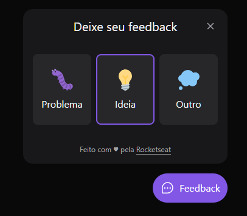
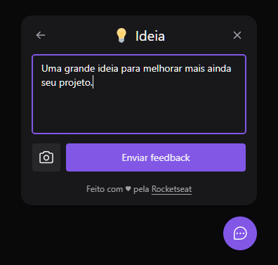

<h1>Feedget</h1>

<h5>Projeto desenvolvido na Next Level Week edição Return, trilha Impulse</h5>

## Sobre

O nome do projeto vem da junção das palavras _feedback_ e _widget_ e resume muito bem sua ação: receber _feedbacks_ e armazená-los em um banco de dados para que o sistema no qual for inserido possa ser melhorado cada vez mais.

Durante a implementação desse projeto foi possível conhecer em detalhe todas as etapas do desenvolvimento, incluindo a integração entre o front e o back-end e a parte de deploy, conteúdos que geralmente não são abordados em outros cursos e semanas de desenvolvimento.

Você pode conferir a versão web aqui: 

## Estrutura

O projeto é composto de três partes:
- Back-end, desenvolvido com Node.js, express.js, Prisma
- Web, desenvolvido com React e Tailwind CSS
- Mobile, desenvolvido com React Native e Expo

Através do site ou do app mobile o usuário pode selecionar o tipo de comentário (bug, ideia ou outro), digitar um texto, gerar uma captura de tela com um clique e enviar para o servidor, que recebe as informações, armazena em banco de dados e conta com sistema de envio de e-mail automático para o dono do projeto.

## Tecnologias

- ### Base

- ### Web

- ### Back-end

- ### Mobile

- ### Deployment

## Instalação e Utilização
- Clonar este repositório
- Instalar as dependências do projeto usando <code>npm install</code>
- Navegar até a pasta "server" e iniciar o servidor com o comando <code>npm run dev</code>
- Na pasta "web" iniciar o cliente com o comando <code>npm run dev</code>
- Para o app mobile você precisa usar um emulador ou ter o aplicativo Expo Go instalado em seu smartphone. Na pasta "mobile" utilizar o comando <code>expo start</code> e seguir as instruções.

## Próximos passos
- Tema light/dark
- Aprimorar o serviço de envio de email (HTML/CSS e serviço de envio em produção)
- Dashboard para visualização dos feedbacks, com autenticação
